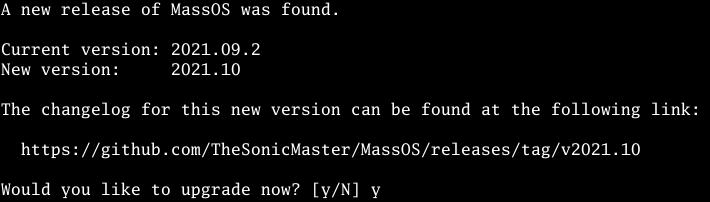
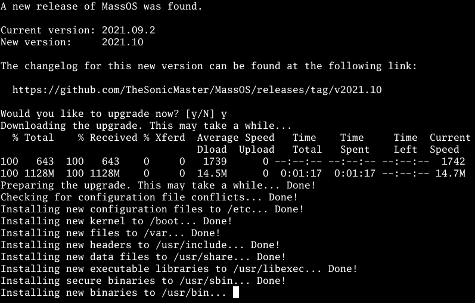

# massos-upgrade
Release upgrade utility for MassOS.
# What is this?
This is a utility which will upgrade your installed version of MassOS to the latest stable release.

This utility should **ONLY** be used on a MassOS system. There is a 110% chance of it breaking your system if you try to straight-up use it on another distro. Alternatively, you could fork it and modify it if you want to use it for your own distro.

If you aren't using MassOS, you can find out more about the operating system from [here](https://github.com/TheSonicMaster/MassOS). If you want to install MassOS, have a look at the [installation guide](https://github.com/TheSonicMaster/MassOS/blob/main/installation-guide.md).
# How to upgrade
## Pre-upgrade notes
This utility is only designed for upgrading an existing installation of MassOS. If you don't yet have MassOS installed, please install it normally by following the [installation guide](https://github.com/TheSonicMaster/MassOS/blob/main/installation-guide.md).

Before upgrading, **it is highly recommended that you back up your data and have an emergency/recovery boot device available**, in case something goes wrong halfway through or the upgrade process gets unexpectedly interrupted.

During the upgrade:

- Do not attempt to run any programs/tasks in the background.
- Ensure the system stays powered on. If it's a laptop, ensure its charger is plugged in; don't rely on battery power.
- Do not allow the system to sleep or hibernate. If you aren't able to manually keep the system awake, go to **Power Manager** settings and set the "blank screen" and "suspend" options to "Never".
- Be extremely patient. Some stages may take a **very** long time with no verbose output, however the upgrade is still working! Allow at least one hour for the entire upgrade to complete.

## Retrieving the upgrade utility
Run the following command to retrieve the MassOS upgrade utility:
```
curl -Os https://raw.githubusercontent.com/TheSonicMaster/massos-upgrade/main/massos-upgrade
chmod 755 massos-upgrade
```
## Run the upgrade utility
The upgrade utility must be run as **root**. If logged in as a regular user, invoke it with `sudo`:
```
sudo ./massos-upgrade
```
The utility will check for a new release of MassOS. If there is one, it will show you some details about the new version, and show a confirmation prompt as to whether you wish to upgrade or not. Answer with `y` to confirm and start the upgrade.

The utility will then proceed to download the upgrade package, prepare the upgrade, and then install the upgrade. As mentioned above, this may take a **very** long time with little to no output, so be extremely patient; the upgrade is still working!

## After the upgrade completes
After the upgrade finishes, you MUST reboot your system before doing anything further.
## Post-upgrade tips and notes

- Some configuration files in `/etc` will have been installed as `/etc/<configuration-file-name>.new`. This indicates that the new file differs from the existing file, and therefore was installed like that to prevent overriding your customisations. You may wish to review each file and decide whether to rename/move the `*.new` file to the original file name or not.
- You may also want to upgrade your Flatpak packages if they were not already automatically updated. Simply run `flatpak update`, or open the GUI "Software" program and check for updates from the "Updates" tab.

# License
This program is free software: you can redistribute it and/or modify
it under the terms of the GNU General Public License as published by
the Free Software Foundation, either version 3 of the License, or
(at your option) any later version.

This program is distributed in the hope that it will be useful,
but WITHOUT ANY WARRANTY; without even the implied warranty of
MERCHANTABILITY or FITNESS FOR A PARTICULAR PURPOSE.  See the
GNU General Public License for more details.

You should have received a copy of the GNU General Public License
along with this program.  If not, see <https://www.gnu.org/licenses/>.
